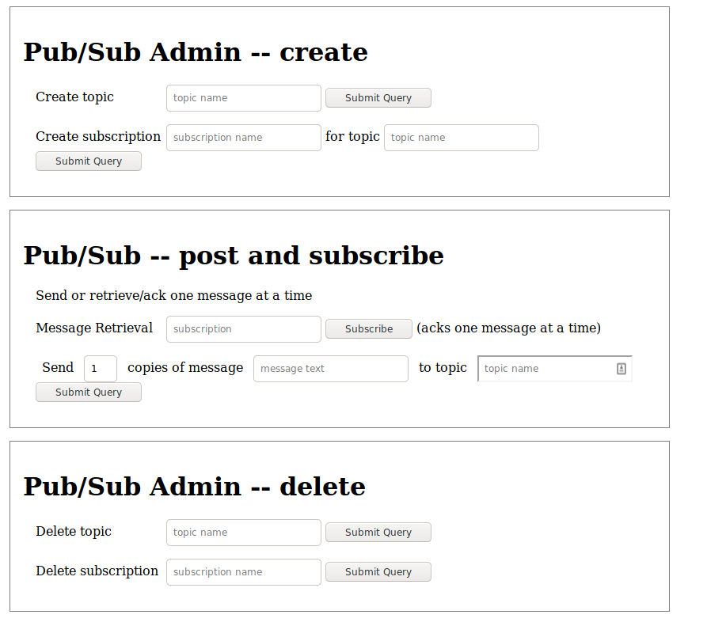

# Quarkus Pub/Sub Sample Application with GraalVM

The Quarkus Pub/Sub sample application demonstrates some common operations with Google Cloud Pub/Sub and is compatible with GraalVM compilation.

This application is built using the [Quarkus Framework](https://quarkus.io/).

The application will show a simple user interface that lets you create and delete Cloud Pub/Sub resources, read messages from topics, and publish messages to topics.



## Setup Instructions

1. Follow the [GCP Project and GraalVM Setup Instructions](../README.md).
You may skip the GraalVM installation step if you would like to build the executable in a container.

2. [Enable the Pub/Sub APIs](https://console.cloud.google.com/apis/api/pubsub.googleapis.com).

## Running the application in dev mode

You can run your application in dev mode that enables live coding using:

```
./mvnw quarkus:dev
```

Then visit http://localhost:8080/ to view the application.

## Creating a native executable

You can create a native executable using: `./mvnw package -P graal`.

If you don't have GraalVM installed, you can run the native executable build in a container using: `./mvnw package -P graal -Dquarkus.native.container-build=true`.
(Note that this method requires Docker to be installed).

You can then execute your native executable with: `./target/quarkus-pubsub-sample-1.0.0-SNAPSHOT-runner`

Then visit http://localhost:8080/ to view the application.

If you want to learn more about building native executables, please consult https://quarkus.io/guides/building-native-image.